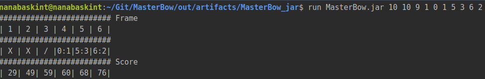

# MasterBow

Little software to display and compute score for a bowling game.

## TODO
  -> test for Game

  -> bound number of frame (10 by default up to 12 if 3 strikes successively)

outputSample (29/06/18@22h12)

  
